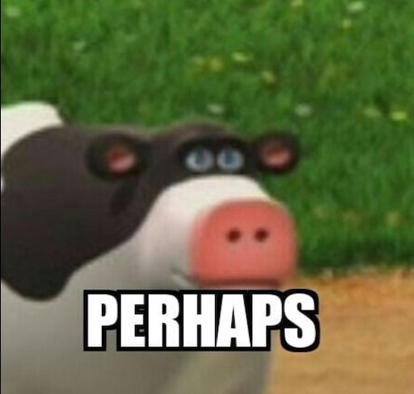

# Welcome to CSE 110 Lab 1

Hey! I am Brian Lam, a 2nd year Computer Science student here at UCSD! 


You can see Lab 1 [here](https://canvas.ucsd.edu/courses/21783/assignments/255474)

## This is Heading 2
### Heading 3...
#### Heading 4....
##### Heading 5.....
###### Heading 6......


Anyways, look at all these text stylings: **BOLD**, *ITALICS*, ~~STRIKETHROUGH~~, **_NESTED_ ITALICS**, ***EXTREMELY IMPORTANT TEXT***.

Heres a cool quote from me:
>The world is made of cheese.

Also my brother said this the other day:
> I really like cheese.

OMG have you tried using `git cheese`? Well... its not a command.

However, these are valid commands:
```
git status
git push
git add
git commit
```

Here is some text.

```markdown
Another block!

1. Animals
2. Food

- Trash cans
- Refrigerators
```

I built this using [GitHub Flavored Markdown!](https://docs.github.com/en/free-pro-team@latest/github/writing-on-github/basic-writing-and-formatting-syntax)

My favorite ice cream(s) are:
- roblox
- github
- cse 110


Wait... those aren't ice creams... Here is my real list:
1. neopolitan
2. chocolate
3. vanilla

Wow this is nested:
1. Cheesecakes?
   - no
     - but yes

Uh oh I have some tasks to do!
- [X] eat cheesecake
- [ ] play some roblox
- [ ] deliver the pizza
- [ ] \(Optional) Take a trip

That's pretty much it for this website!

I love making new paragraphs and \*Ignoring\* markdown formatting.

Here is another cool [LINK!](https://www.youtube.com/watch?v=dQw4w9WgXcQ)

Also here is a pretty cool cow:


Back to the [top!](README.md)
